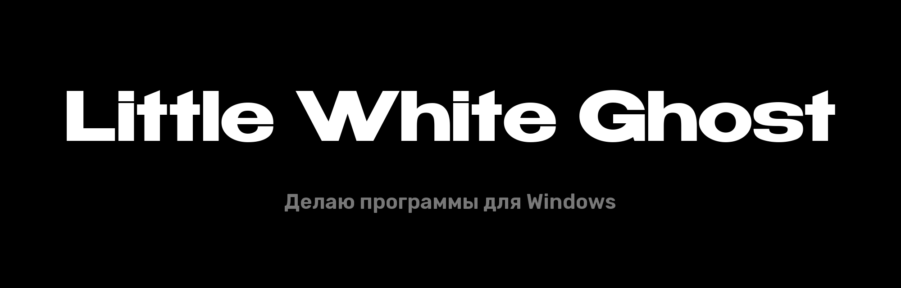
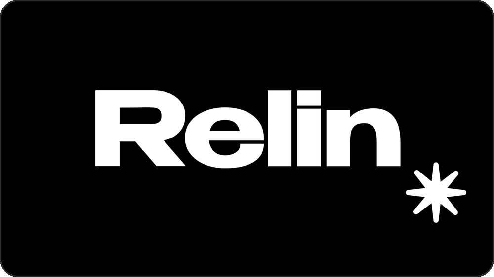
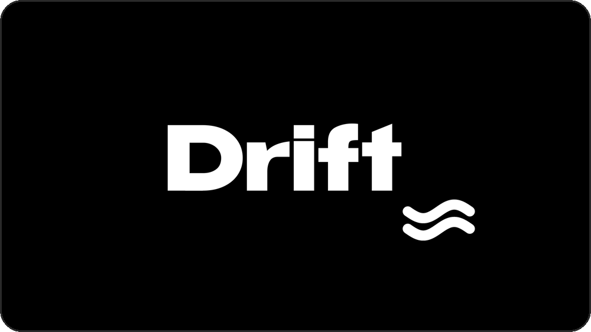

  

  Делаю быстрые и красивые программы для Windows: без рекламы, без регистрации, со своим дизайном.

 

<table>
  <tr>
    <td width="50%" valign="top">
      
      <h3>Relin</h3>
      Скачивает видео и музыку с YouTube, TikTok, Twitch, VK и ещё 1800 сайтов на максимальном качестве. Ловит скопированные ссылки, режет куски, делает GIF, записывает стримы. Внутри студия: улучшение качества нейросетью и правка фото и видео.
        
      <a href="https://github.com/WhIteGh0s1/relin/releases/latest/download/relin-setup.exe">Скачать</a> &nbsp;·&nbsp; <a href="https://github.com/WhIteGh0s1/relin">Подробнее</a>
    </td>
    <td width="50%" valign="top">
      
      <h3>Drift</h3>
      Живые видеообои для рабочего стола. Любое видео или GIF, несколько мониторов, автосмена. Работает на видеокарте, около 0,5% процессора, и сам встаёт на паузу в играх.
        
      <a href="https://github.com/WhIteGh0s1/drift/releases/latest/download/Drift-setup.exe">Скачать</a> &nbsp;·&nbsp; <a href="https://github.com/WhIteGh0s1/drift">Подробнее</a>
    </td>
  </tr>
</table>

 

## На чём пишу

C# и .NET, Python, WinForms, WebView2, Media Foundation, FFmpeg, yt-dlp, Real-ESRGAN.

Relin и Drift работают вместе: скачал видео в Relin, одна кнопка — и оно уже на рабочем столе в Drift.

 

Little White Ghost

